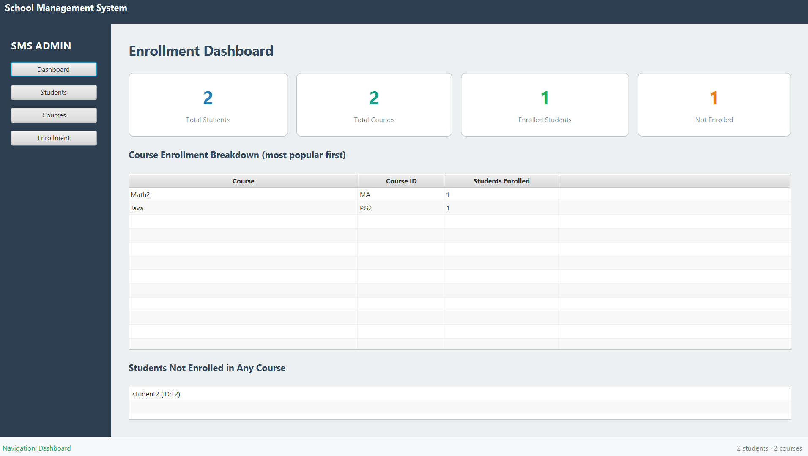
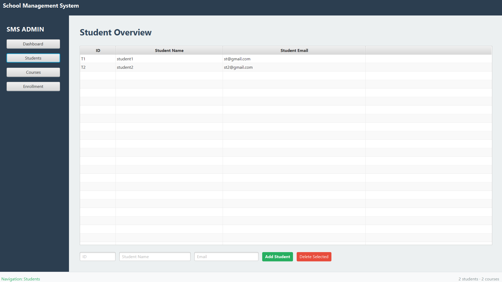
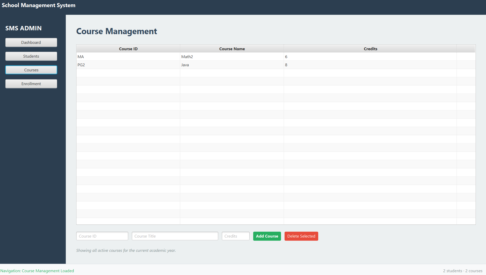
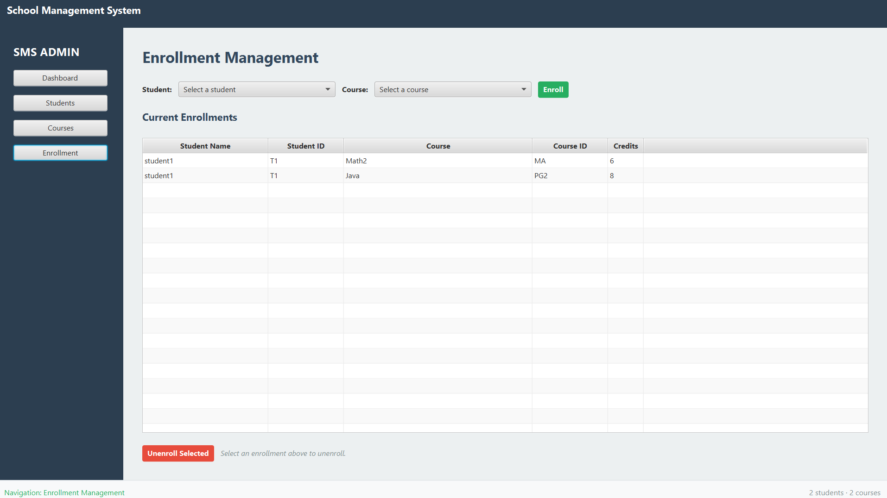

# School Management System

A desktop application for administering students, courses, and enrollments at a small school. Built as a personal project to practice Java 21, JavaFX, and working with structured data (aggregation, filtering, and JSON persistence). The scope is intentionally small so the code stays readable, and the project uses layered architecture with a separate persistence layer to keep the domain and the UI independent.

## Screenshots

### Dashboard


### Students


### Courses


### Enrollment


## Features

* **Manage students.** Add and remove students identified by a unique ID, name, and email. Removing a student also unenrolls them from every course they were registered in.
* **Manage courses.** Add and remove courses with course ID, title, and credit value. Removing a course unenrolls every student registered for it.
* **Enroll and unenroll.** A dedicated enrollment view with two dropdowns and a live table of current enrollments across all students and courses.
* **Dashboard with statistics.** Four summary cards (total students, total courses, students with at least one enrollment, students not enrolled) plus a course breakdown table ranked by enrollment count and a scrollable panel of students not enrolled in any course.
* **Automatic persistence.** All data is saved to a local JSON file when the application closes and reloaded on next startup. No database required.

## Tech Stack

* **Java 21** (records with lambda cell value factories, `.toList()`, stream pipelines)
* **JavaFX 21.0.6** for the desktop UI (FXML for layout, inline styling)
* **Jackson 2.17.2** for JSON serialization and deserialization
* **JUnit 5.12.1** for unit testing
* **Maven** as the build tool
* **Java Platform Module System** (`module-info.java`)

## Architecture

The project is organized as layered architecture, with the JavaFX UI on top and a JSON persistence layer at the bottom. The domain model and the persistence format are kept separate through a mapper class, so the storage format can change without touching business logic.

```
+--------------------------------------------------------+
|                   JavaFX UI Layer                      |
|   main-view.fxml     courses-view.fxml                 |
|   enrollment-view.fxml     dashboard-view.fxml         |
+----------------------------+---------------------------+
                             |
                             v
+--------------------------------------------------------+
|                    MainController                      |
|    Handles user actions, populates tables and cards    |
+----------------------------+---------------------------+
                             |
                             v
+--------------------------------------------------------+
|                     Domain Model                       |
|      SchoolManager     Student     Course              |
+----------------------------+---------------------------+
                             |
                             v
+--------------------------------------------------------+
|                  Persistence Layer                     |
|   SchoolData (DTO)     SchoolDataMapper                |
|         PersistenceService (Jackson JSON)              |
+----------------------------+---------------------------+
                             |
                             v
                      ~/.sms-data.json
```

**Domain layer** (`models`): plain Java objects with no framework dependencies. `SchoolManager` owns the lists of students and courses and provides methods to add, remove, find, and query. `Student` and `Course` hold references to each other, kept consistent by explicit `enroll` and `unenroll` methods on `Student`.

**UI layer** (`controllers`, `resources`): FXML files describe the layout, one per view. `MainController` handles all four views by loading their FXML on demand and setting itself as the controller. This keeps the shared reference to the `SchoolManager` instance in one place.

**Persistence layer** (`persistence`): `SchoolData` is a set of records that mirror the domain shape but are pure data (a DTO). `SchoolDataMapper` converts between domain objects and DTOs in both directions. `PersistenceService` reads and writes the DTO to `~/.sms-data.json` using Jackson. The domain never knows how or where it is being saved.

## Project Structure

```
School_Management_System/
├── pom.xml
├── README.md
├── LICENSE
├── docs/
│   ├── dashboard.png
│   ├── students.png
│   ├── courses.png
│   └── enrollment.png
├── src/
│   ├── main/
│   │   ├── java/
│   │   │   ├── module-info.java
│   │   │   └── com/example/school_management_system/
│   │   │       ├── Launcher.java
│   │   │       ├── SchoolManagementApp.java
│   │   │       ├── controllers/
│   │   │       │   └── MainController.java
│   │   │       ├── models/
│   │   │       │   ├── Course.java
│   │   │       │   ├── SchoolManager.java
│   │   │       │   └── Student.java
│   │   │       └── persistence/
│   │   │           ├── PersistenceService.java
│   │   │           ├── SchoolData.java
│   │   │           └── SchoolDataMapper.java
│   │   └── resources/
│   │       └── com/example/school_management_system/
│   │           ├── main-view.fxml
│   │           ├── courses-view.fxml
│   │           ├── enrollment-view.fxml
│   │           └── dashboard-view.fxml
│   └── test/
│       └── java/
│           └── com/example/school_management_system/
│               ├── models/
│               │   ├── StudentTest.java
│               │   └── CourseTest.java
│               └── persistence/
│                   ├── PersistenceServiceTest.java
│                   └── SchoolDataMapperTest.java
```

## Getting Started

### Prerequisites

* JDK 21 or newer
* Maven 3.8 or newer

You do not need to install JavaFX separately. Maven pulls the JavaFX 21.0.6 modules automatically from Maven Central based on the `pom.xml`.

### Clone and run

```bash
git clone https://github.com/Emilia-Mezini/School_Management_System.git
cd School_Management_System
mvn clean javafx:run
```

The application window opens on the Students view by default. Use the sidebar on the left to switch between Dashboard, Students, Courses, and Enrollment.

### Running the tests

```bash
mvn test
```

Twelve unit tests cover the domain layer (Student and Course behavior, enrollment consistency) and the persistence layer (round-trip serialization, mapper correctness, empty state handling, JSON file read and write via `@TempDir`).

## Data Persistence

All data is stored in a single JSON file at `~/.sms-data.json` in your user home directory. The file is written when the application closes cleanly. On startup, if the file exists its contents are loaded into memory. If the file is missing or unreadable, the application starts with an empty school.

The file format is straightforward:

```json
{
  "schoolName": "My School",
  "students": [
    { "studentId": "T1", "name": "student1", "email": "st@gmail.com" }
  ],
  "courses": [
    { "courseId": "MA", "title": "Math2", "numberOfCredits": 6 }
  ],
  "enrollments": [
    { "studentId": "T1", "courseId": "MA" }
  ]
}
```

Enrollments are stored as a separate list of `(studentId, courseId)` pairs rather than embedded inside each student or course record. This keeps the format simple and avoids duplicating data. The mapper reconstructs the bidirectional links on load.

You can edit the file by hand if you need to, though normally you would just use the UI.

## Known Limitations

These are conscious scope choices for a personal learning project, not oversights.

* **Single-user desktop application.** No multi-user support and no concurrent access. Running two instances against the same JSON file would cause the last save to overwrite the other.
* **No authentication or user roles.** Anyone with access to the machine can view or modify all data.

## Author

Built by Emilia Mezini, computer science student at OTH Regensburg. Reach me on [LinkedIn](https://www.linkedin.com/in/emilia-mezini).
